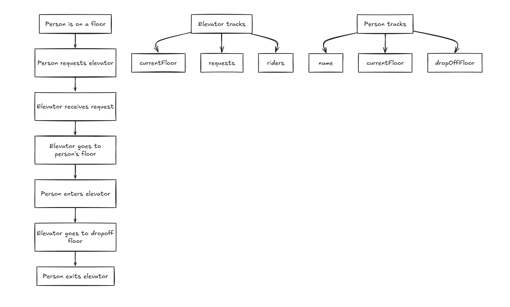

# Challenge Levels Guide

This file is my simple walkthrough of how I approached the challenge and how each level is covered in this repo.

## How To Run It

What I use locally is:

1. Run `npm install`
2. Run `npm test`
3. Run `npm start`
4. Open `http://localhost:3000`

That gives me:

- the automated tests for the elevator logic
- the browser visualization
- the API-backed version of the simulation

## Level 0

For Level 0, I treated it as the planning step before writing code.

The README says pencil and paper, but I used Excalidraw instead. I did not have a pen available, and going all the way down to town just to buy one was not practical. Excalidraw let me do the same planning work clearly in digital form.

Here is the sketch I used:

The main idea in that sketch is simple:

1. A person is on a floor.
2. The person requests the elevator.
3. The elevator receives the request.
4. The elevator goes to that person's floor.
5. The person enters.
6. The elevator goes to the dropoff floor.
7. The person exits.

The sketch also shows the main state I wanted to track:

- Elevator: `currentFloor`, `requests`, `riders`
- Person: `name`, `currentFloor`, `dropOffFloor`

## Level 1

For Level 1, I created the `Person` and `Elevator` classes.

`Person` stores:

- name
- current floor
- dropoff floor

`Elevator` stores:

- current floor
- request queue
- rider list

The elevator starts on floor `0`, which is the lobby.

Main files:

- `person.js`
- `elevator.js`
- `src/domain/Person.js`
- `src/domain/Elevator.js`

## Level 2

For Level 2, I added tests for the basic ride cases and the elevator behavior.

That includes:

- one person going up
- one person going down
- checking total stops
- checking floors traversed
- direct coverage for the elevator methods

Main file:

- `tests/elevator.test.js`

## Level 3

For Level 3, I made sure the elevator tracks efficiency-related values.

That means it keeps track of:

- how many floors it traveled
- how many stops it made

Those values are part of the shared elevator logic and are checked in tests.

Main files:

- `src/domain/Elevator.js`
- `tests/elevator.test.js`

## Level 4

For Level 4, I added support for multiple requests.

The baseline behavior is first-come, first-served, which means the elevator handles requests in the order they were made.

I also matched the named example from the README directly:

- Bob starts on floor `3` and goes to floor `9`
- Sue starts on floor `6` and goes to floor `2`
- the baseline version serves Bob first, then Sue

Main files:

- `src/domain/dispatchStrategies.js`
- `src/domain/Elevator.js`
- `tests/elevator.test.js`

## Level 5

For Level 5, I added the two-person direction combinations from the prompt:

- Person A up, Person B up
- Person A up, Person B down
- Person A down, Person B up
- Person A down, Person B down

For those scenarios, I check:

- total floors traversed
- total stops
- requests cleared after dispatch
- riders cleared after dispatch
- completed rides recorded correctly

Main file:

- `tests/elevator.test.js`

## Level 6

For Level 6, I added the time-based idle behavior.

The rule is:

- before noon, the elevator returns to the lobby when it has no riders and no pending requests
- after noon, it stays on the last floor instead of returning to the lobby

I covered both cases directly in tests.

Main files:

- `src/domain/Elevator.js`
- `tests/elevator.test.js`

## Level 7

For Level 7, I added an optimized dispatch strategy.

The baseline version is the simple first-come, first-served strategy. The optimized version looks for a shorter overall plan so the elevator does not waste movement.

I compare the optimized version against the benchmark scenarios one by one.

The result is:

- three scenarios improve clearly
- one scenario ties the baseline because the baseline is already at the shortest possible path in that case

So the optimized strategy is never worse, and it improves the scenarios where there is actual room to improve.

Main files:

- `src/domain/dispatchStrategies.js`
- `tests/elevator.test.js`

## Level 8

For Level 8, I built the DOM-based visualization.

The UI shows:

- the building floors
- the elevator car
- waiting requests
- rider state
- completed rides
- event history

This makes the simulation easier to understand visually instead of only through tests.

Main files:

- `public/index.html`
- `public/styles.css`
- `public/app.js`

## Level 9

For Level 9, I moved the request and rider flow behind API calls.

So instead of the UI being the source of truth, the frontend now talks to a backend layer for:

- reading state
- adding requests
- dispatching the elevator
- resetting the simulation

I treated the README wording as allowing a Node backend or an Express backend. I used a plain Node backend here to keep the project lighter and avoid adding extra dependencies that were not necessary for the challenge.

Main files:

- `src/server/SimulationStore.js`
- `src/server/createServer.js`
- `server/index.js`

## How I Structured The Project

I kept the logic modular on purpose.

The shared domain layer means:

- the tests use the same elevator logic as the app
- the backend uses the same elevator logic too
- the frontend stays simpler because it renders state instead of owning the business logic

That made the project easier to test, easier to explain, and easier to extend from Level 1 all the way to Level 9.

## Short Version I Can Say Out Loud

I approached the challenge in layers. First, I planned the elevator flow in Excalidraw. Then I built the shared `Person` and `Elevator` logic and covered Levels 1 to 7 with tests. After that, I added the browser visualization for Level 8. Finally, I added the backend API flow for Level 9 so the UI talks to the server instead of handling everything directly. I kept it modular so the same elevator logic is reused across the tests, the UI, and the backend.
